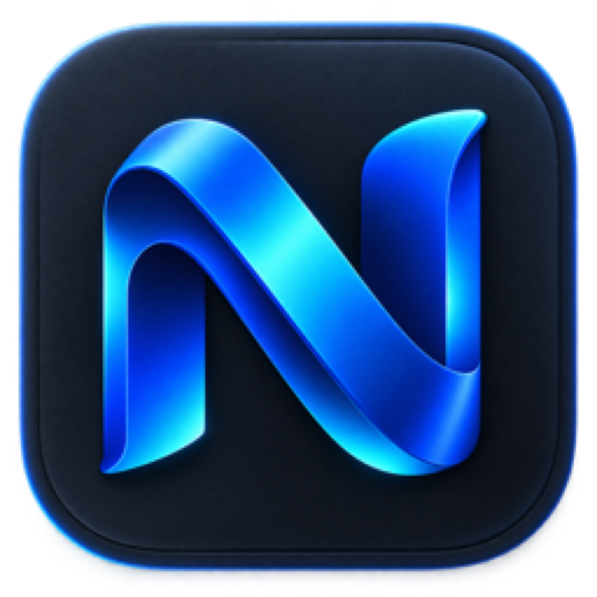

# NeBrowser



NeBrowser — независимый браузер AffPapa на открытом движке Firefox. У него
собственное имя, иконка и идентификатор приложения, а стартовая страница
ведёт на [affpapa.org](https://affpapa.org/).

[Страница продукта](https://affpapa.org/nebrowser/) ·
[GitHub Releases](https://github.com/AffPapa/nebrowser/releases)

> NeBrowser не связан с Mozilla, не спонсируется и не одобряется Mozilla.
> Firefox и Mozilla являются товарными знаками Mozilla Foundation.

## Что внутри

- Firefox 153.0.4 как воспроизводимая upstream-база;
- отдельный macOS bundle `org.affpapa.nebrowser`;
- брендинг NeBrowser без пользовательских знаков Firefox;
- отключённые Mozilla Telemetry, Studies, Normandy, Crash Reporter и updater;
- первая платформа — macOS 14+ на Apple Silicon;
- публичная сборка только через Developer ID, notarization, stapling и
  Gatekeeper-проверку.

## Скачать

Технический preview можно скачать в
[GitHub Releases](https://github.com/AffPapa/nebrowser/releases/tag/v0.1.1-preview).
Это ad-hoc/unsigned QA-сборка: macOS может не открыть её обычным двойным
кликом. Она не считается стабильным пользовательским релизом.

Нормальный публичный релиз появится после Apple notarization. Он будет
подписан Developer ID, stapled и проверен Gatekeeper.

## Собрать из исходников

```sh
./scripts/build-macos.sh
./scripts/verify-package.sh
./scripts/package-local.sh
```

Upstream Firefox разворачивается под `.cache/` и в Git не попадает. Полная
инструкция: [docs/BUILDING.md](docs/BUILDING.md). Условия распространения и
атрибуция: [docs/LICENSING.md](docs/LICENSING.md).

## Статус

Версия NeBrowser: **0.1.1**. Движок: **Firefox 153.0.4**. Проект находится в
стадии public alpha.

## Безопасность

Не публикуйте уязвимости в Issues. Используйте процедуру из
[SECURITY.md](SECURITY.md).

## Лицензия

Изменения NeBrowser и Firefox overlay распространяются по Mozilla Public
License 2.0. См. [LICENSE](LICENSE) и [NOTICE.md](NOTICE.md).
